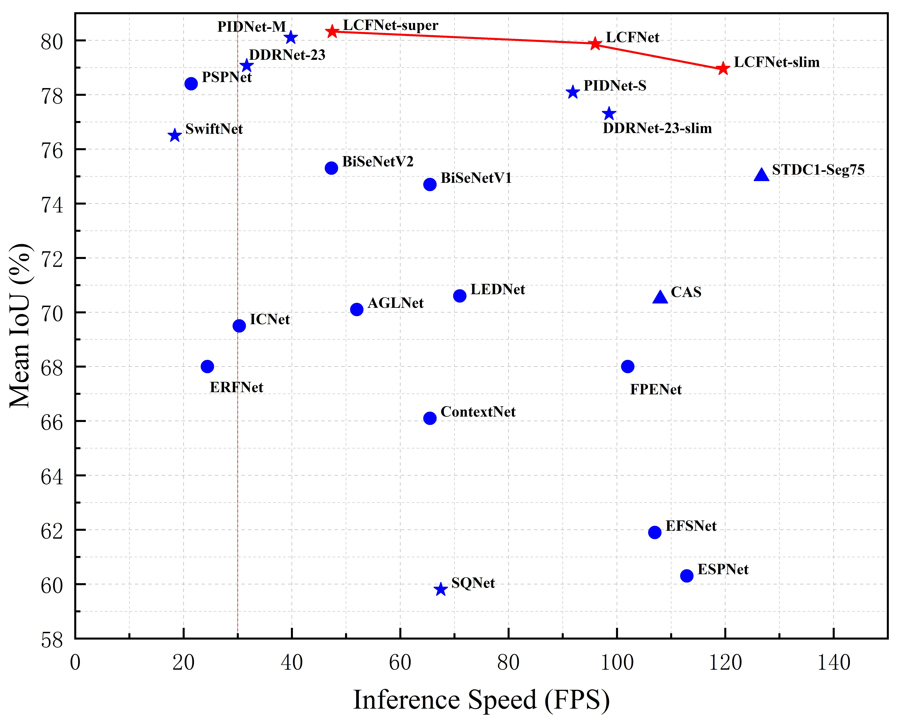
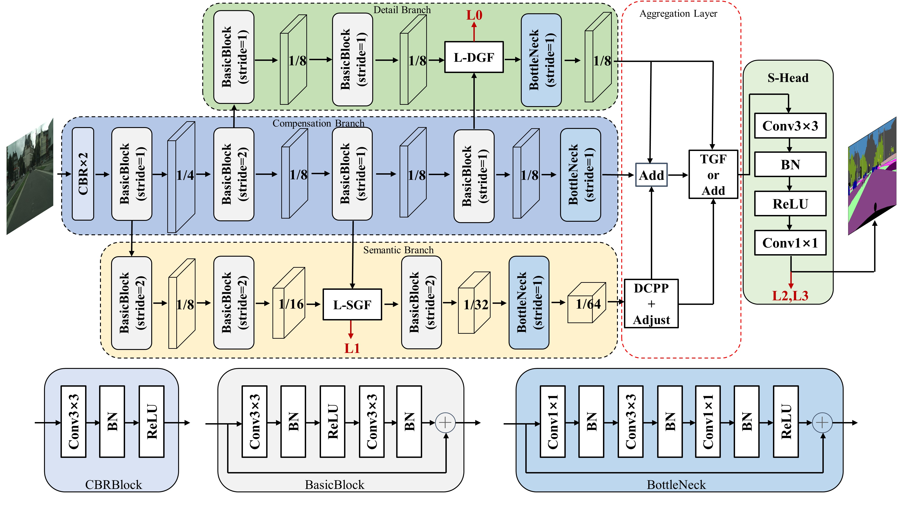
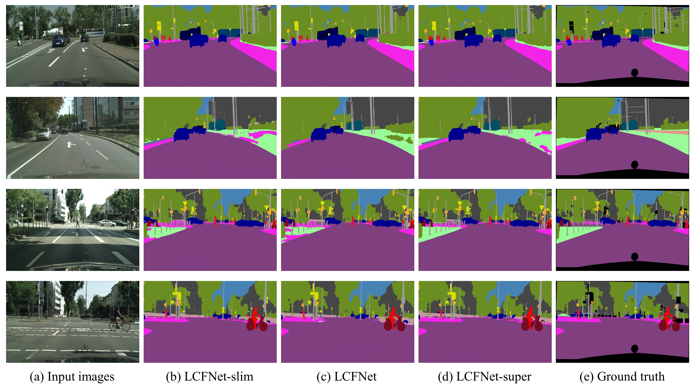
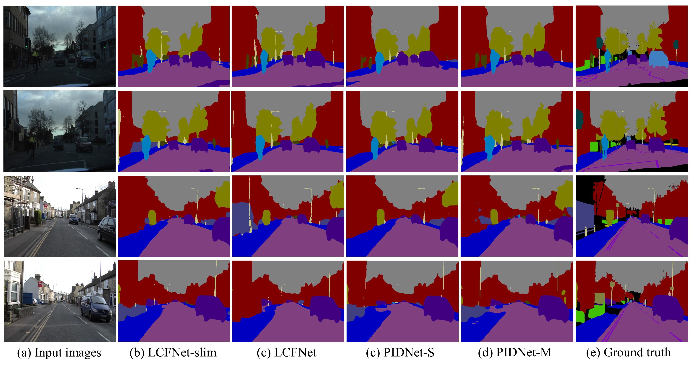

# LCFNets: Compensation Strategy for Real-time Semantic Segmentation of Autonomous Driving

This repository contains the official Pytorch implementation of training & evaluation code for [LCFNets](https://ieeexplore.ieee.org/document/10428050)(IEEE TIV)🔥

Earlier work is published in [IEEE ITSC](https://ieeexplore.ieee.org/document/10422086)🔥

Authors : Lu Yang, Yiwen Bai, Fenglei Ren, Chongke Bi, Ronghui Zhang 


## News
Due to the amount of research involved, the time to maintain this implementation code is very limited. We will compile the complete code and upload it to this repository as soon as possible.


## Introduction
<p align="center">
  </br>
  <span align="center">Comparison of inference speed and accuracy for real-time models on test set of Cityscapes. Red and blue stars refer to results for 2048 × 1024 resolution input. Blue triangles refer to results for 1536 × 768 resolution input. Blue dots refer to results for 1024 × 512 resolution input. Our LCFNets (red stars) achieves a better trade-off between segmentation speed and accuracy.</span> 
</p>


* **Compensation branch**:  A novel compensation branch is introduced in the bilateral networks for the first time. It not only compensates for features lost in detail and semantic branches, but also prevents features of the original images from being overwhelmed in the inference stage.
* **Compensation strategy**:  To balance the three-branch features and guide them to fuse effectively, two efficient modules (L-DGF and L-SGF) and a novel aggregation layer are designed. DCPP and TGF modules enable the aggregation layer to extract the global receptive field and realize multi-branch aggregation with low calculation complexity.
* **A better trade-off**: LCFNets outperform many state-of-the-art methods on a single RTX 2080Ti GPU, providing a better trade-off of accuracy and speed. On Cityscapes, LCFNet-slim achieves 76.86\% mIoU at 114.36 FPS. LCFNet-super achieves 79.10\% mIoU at 47.46 FPS. On CamVid, LCFNets have an accuracy of more than 80\% mIoU and a very high inference speed. In addition, LCFNet-slim obtains the highest score using our proposed evaluation metric named trade-off factor.


## Overview
<p align="center">
  </br>
  <span align="center">The detail structure of LCFNet. </span> 
</p>
L-DGF is Lightweight Detail Guidance Fusion module, L-SGF is Lightweight Semantic Guidance Fusion module, TGF is Total Guidance Fusion module, DCPP is Depth-wise Convolution Pyramid Pooling module, and S-Head represents Segmentation Head.


## Datasets

* Download the [Cityscapes](https://www.cityscapes-dataset.com/) and [CamVid](http://mi.eng.cam.ac.uk/research/projects/VideoRec/CamVid/) datasets and unzip them in `data/cityscapes` and `data/camvid` dirs.
* Check if the paths contained in lists of `data/list` are correct for dataset images.


## Results on Cityscapes and CamVid

### Cityscapes
| Method  | Pretrain | Val (% mIOU) | Test (% mIOU) | FPS(torch) |
| ------- |----------|--------------|---------------|------------|
| LCFNet-slim | No       | 76.86        | 76.85         | 114.36     |
| LCFNet | No       | 77.96        | 77.93         | 92.37      |
| LCFNet-super | No       | 79.10        | 79.07         | 47.46      |
| LCFNet-slim | ImageNet | 78.96        | 78.95         | 114.36      |
| LCFNet | ImageNet       | 79.87        | 79.87         | 92.37      |
| LCFNet-super | ImageNet       | 80.32        | 80.30         | 47.46      |


### CamVid
| Method  | Pretrain   | Val (% mIOU) | Test (% mIOU) | FPS(torch) |
| ------- |------------|--------------|---------------|------------|
| LCFNet-slim | No         | 75.58        | 75.58         | 176.51     |
| LCFNet | No         | 77.06        | 77.06         | 159.85     |
| LCFNet-slim | Cityscapes | 82.50        | 82.50         | 176.51     |
| LCFNet | Cityscapes | 85.52        | 85.52           | 159.85     |


## Visualizations

The visualization results of LCFNets on the Cityscapes and Camvid datasets are shown. It can be seen that the LCFNets do a very good job of segmenting objects in the categories of cars, bicycles, roads, sky, etc. The boundary contours of small target objects such as traffic lights and poles are also clearly shown by LCFNets. This justifies the introduction of compensation branch to improve segmentation accuracy.
<p align="center">
  </br>
  <span align="center"> An illustration of the segmentation performance of LCFNet on Cityscapes.</span>
</p>

<p align="center">
  </br>
  <span align="center">An illustration of the segmentation performance of LCFNet on Camvid.</span>
</p>


## Citation

If you think this implementation is useful for your work, please cite our paper:
```
@ARTICLE{bai2024lcfnet,
  author={Yang, Lu and Bai, Yiwen and Ren, Fenglei and Bi, Chongke and Zhang, Ronghui},
  journal={IEEE Transactions on Intelligent Vehicles}, 
  title={LCFNets: Compensation Strategy for Real-Time Semantic Segmentation of Autonomous Driving}, 
  year={2024},
  volume={9},
  number={4},
  pages={4715-4729},
  keywords={Semantic segmentation;Semantics;Convolution;Feature extraction;Real-time systems;Complexity theory;Transformers;Compensation strategy;multi-branch aggregation;real-time semantic segmentation;autonomous driving},
  doi={10.1109/TIV.2024.3363830}}
```


## Acknowledgement

* Our implementation is modified based on [PIDNet-Semantic-Segmentation](https://github.com/XuJiacong/PIDNet) and [HRNet-Semantic-Segmentation](https://github.com/HRNet/HRNet-Semantic-Segmentation).
* Thanks for their nice contribution.

