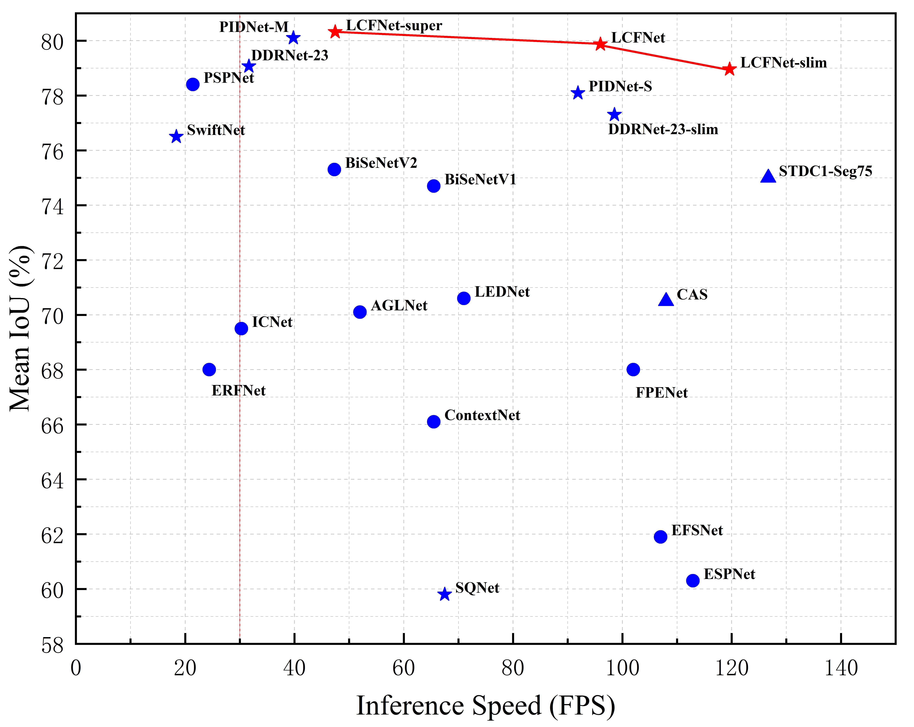
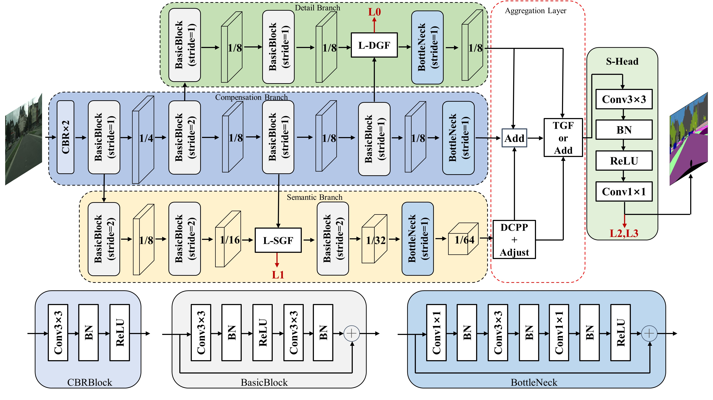
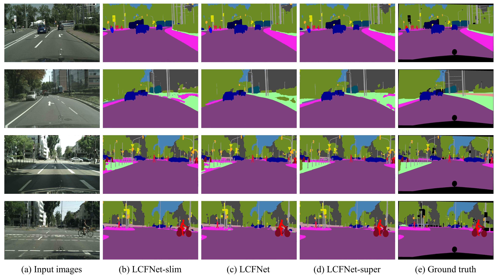
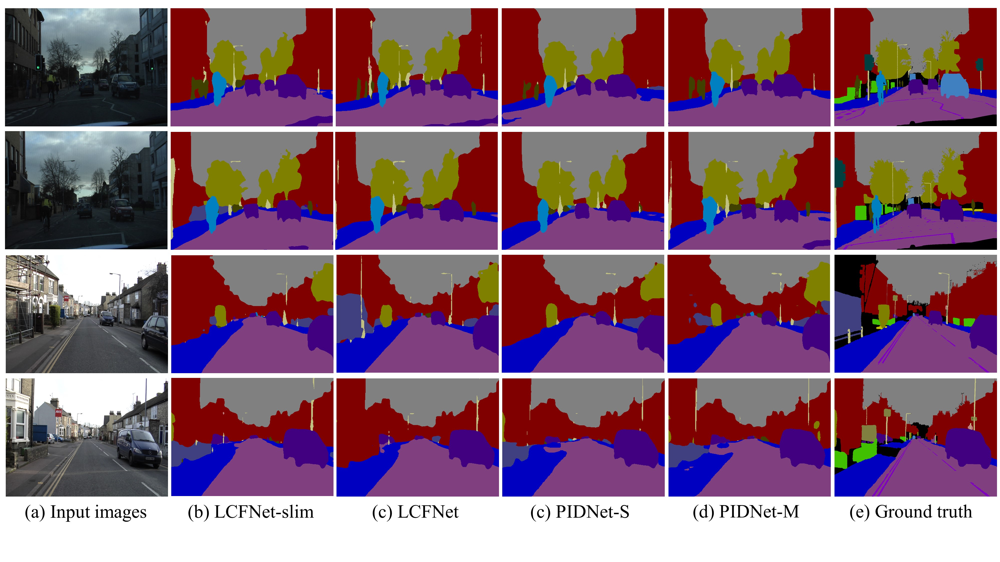

# LCFNet: Compensation Strategy for Bilateral Real-time Semantic Segmentation of Autonomous Driving

Authors : Lu Yang, Yiwen Bai, Fenglei Ren, and Chongke Bi 

## Introduction

   
  Comparison of inference speed and accuracy for real-time models on test set of Cityscapes. 

* **Compensation strategy**:  A compensatory strategy is proposed to improve the accuracy of bilateral segmentation network. It involves the introduction of an extra branch and two novel modules(L-DGF and L-SGF). Based on this strategy, we propose a novel three-branch network called LCFNets that achieves a better trade-off between accuracy and speed.
* **A better trade-off**: LCFNets outperforms many state-of-the-art methods on the RTX 2080Ti, providing a better trade-off of accuracy and speed. On Cityscapes, LCFNet-slim achieves 76.32% mIoU at 134.36 FPS. LCFNet achieves 77.02% mIoU at 91.02 FPS. On CamVid, LCFNets have an accuracy of more than 80% mIoU and a very high inference speed.

## Platform

Our platform is like this: 

* ubuntu 18.04
* a single NVIDIA GeForce RTX 2080Ti GPU
* cuda 10.2
* cudnn 7.5.1
* conda python 3.7
* pytorch 1.8.1

## Overview

   
  The detail structure of LCFNet.  

L-DGF is Lightweight Detail Guidance Fusion module, L-SGF is Lightweight Semantic Guidance Fusion module, TGF is Total Guidance Fusion module, DCPP is Depth-wise Convolution Pyramid Pooling module, and S-Head represents Segmentation Head.

## Datasets

* Download the [Cityscapes](https://www.cityscapes-dataset.com/) and [CamVid](http://mi.eng.cam.ac.uk/research/projects/VideoRec/CamVid/) datasets and unzip them in `data/cityscapes` and `data/camvid` dirs.
* Check if the paths contained in lists of `data/list` are correct for dataset images.

## Results on Cityscapes and Camvid

| Model (Cityscapes) | Val (% mIOU) | Test (% mIOU)| FPS |
|:-:|:-:|:-:|:-:|
| LCFNet-slim | 76.32 | 76.18 | 134.36 |
| LCFNet | 77.02 | 76.85 | 91.02 |
| LCFNet-super | 79.10 | 79.02 | 47.46 |

| Model (CamVid) | Val (% mIOU) | Test (% mIOU)| FPS |
|:-:|:-:|:-:|:-:|
| LCFNet-slim |-| 80.40 | 206.51 |
| LCFNet |-| 81.33 | 189.85 |

## Visualizations

The visualization results of LCFNets on the Cityscapes and Camvid datasets are shown. It can be seen that the LCFNets do a very good job of segmenting objects in the categories of cars, bicycles, roads, sky, etc. The boundary contours of small target objects such as traffic lights and poles are also clearly shown by LCFNets. This justifies the introduction of compensation branch to improve segmentation accuracy.

   
   An illustration of the segmentation performance of LCFNet on Cityscapes.

   
  An illustration of the segmentation performance of LCFNet on Camvid.

## Citation

Since this paper has not been published yet, If you find the method we propose useful for your work and would like to draw on it, please contact the mailbox: wen1109@stud.tjut.edu.cn

## Acknowledgement

* Our implementation is modified based on [PIDNet-Semantic-Segmentation](https://github.com/XuJiacong/PIDNet) and [HRNet-Semantic-Segmentation](https://github.com/HRNet/HRNet-Semantic-Segmentation).
* Thanks for their nice contribution.

